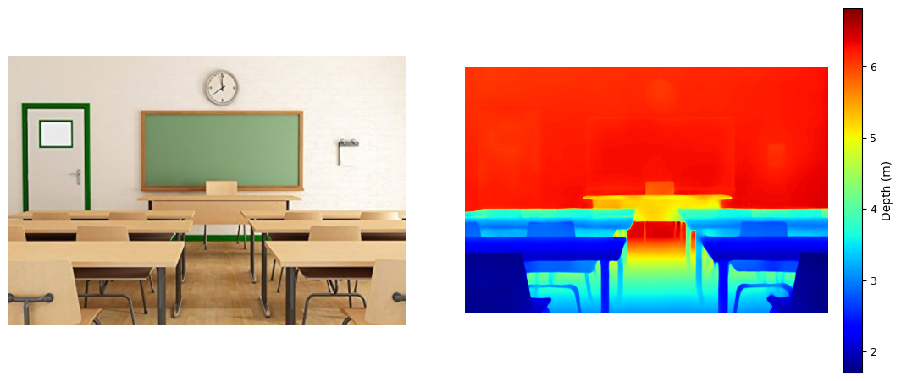
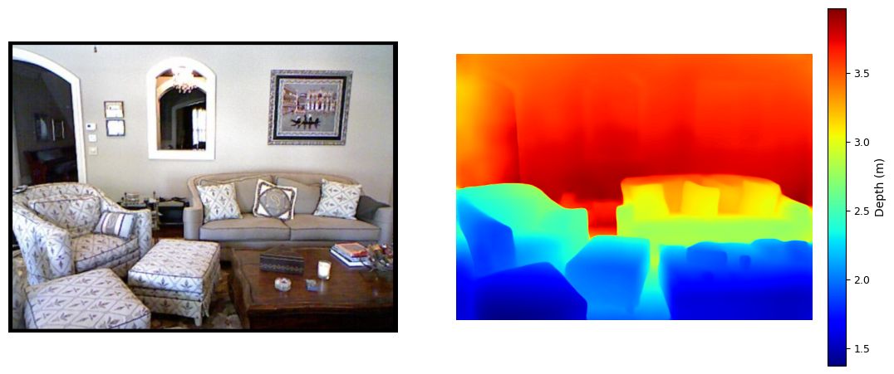
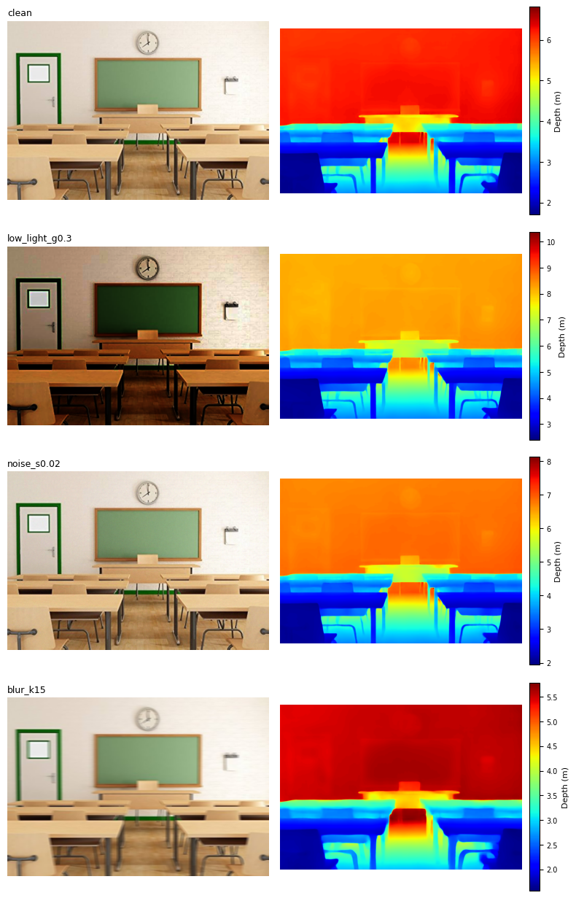
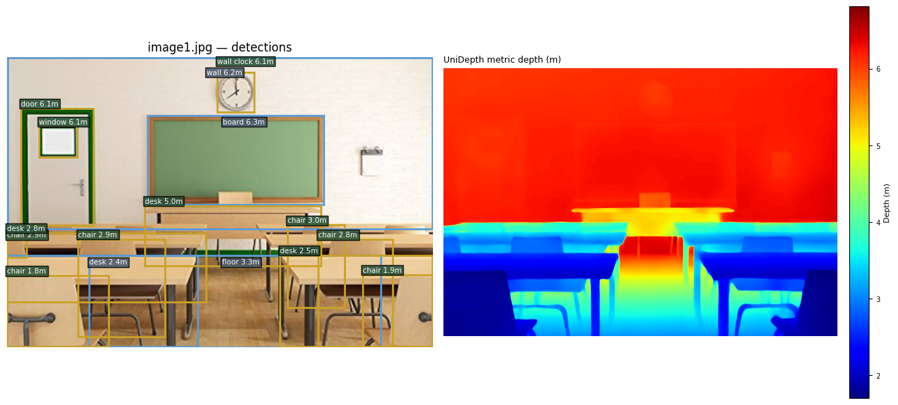
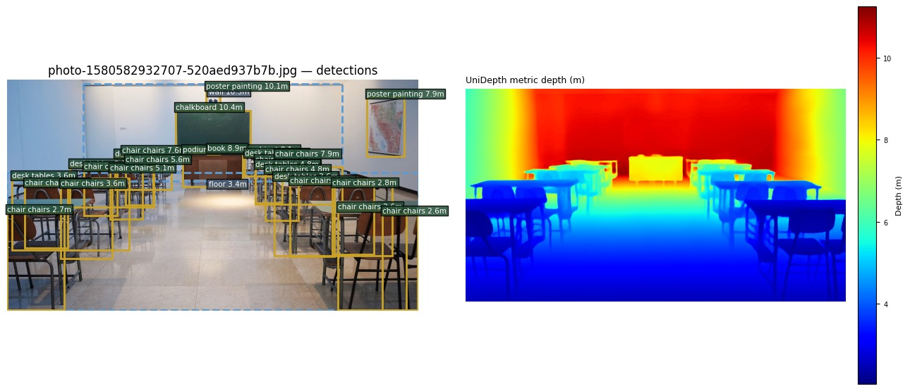
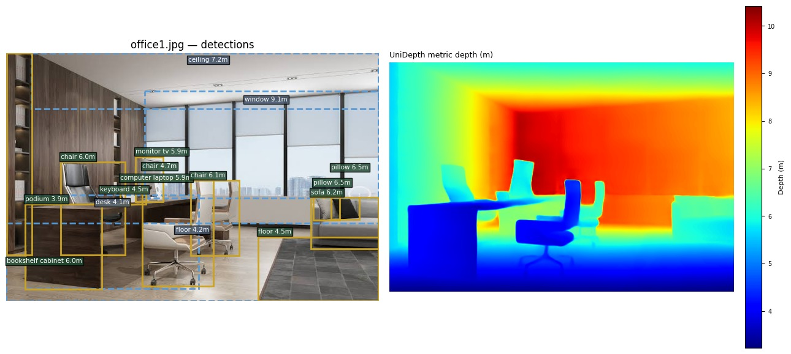

# Reproducing UniDepth for Mobile Robot Perception

**A Robustness and Open-Vocabulary Object-Level Fusion Study**

Muhammad Mudassir Shakeel — Department of Mechatronics Engineering, University of Engineering and Technology, Lahore
Course: Mobile Robotics Systems — Group B, Perception & Semantic Mapping — Instructor: Dr. Maria Akram

[](LICENSE)

---

## Overview

This repository reproduces [UniDepth](https://github.com/lpiccinelli-eth/UniDepth) — a universal
monocular *metric* depth model that predicts a dense depth map **and** its own camera intrinsics
from a single uncalibrated RGB image — and contributes three original extensions aimed at mobile
robot deployment:

| Extension | What it does |
|---|---|
| **I — Robustness sweep** | Degrades a test photo under low light, Gaussian noise, and motion blur (9 conditions), and measures how far each prediction drifts from the clean-image baseline. |
| **II — Object-level depth fusion** | Pairs an open-vocabulary detector (Grounding DINO + BLIP captioning) with UniDepth's dense output to produce a `(object label, distance)` list per scene — the representation a planner like [VLFM](https://arxiv.org/abs/2312.03176) actually consumes. |
| **III — Cross-backbone consistency** | Runs all three official UniDepthV2 checkpoints (ViT-S/B/L) on the same image and quantifies how much their absolute depth scale disagrees. |

Full methodology, results, and discussion are in the paper: [`docs/UniDepth_Report_Final.pdf`](docs/UniDepth_Report_Final.pdf).

> **Note on ROS2 / robot platform.** This project is a **perception-only** reproduction, evaluated
> purely as a camera-in-the-loop module (see the report's Limitations section). No physical or
> simulated robot was used this semester, so there is no ROS2 workspace in this repository. The
> object-distance list produced by Extension II is formatted so it could feed a frontier- or
> obstacle-avoidance planner in future work — see "Future Work" in the report.

---

## Repository Structure

```
.
├── README.md                          # this file
├── LICENSE
├── requirements.txt                   # Python dependencies
├── docs/
│   └── UniDepth_Report_Final.pdf      # full IEEE-style report (methodology, results, discussion)
├── notebooks/
│   └── UniDepth_Extensions_Colab.py   # the exact, runnable Colab script (Jupytext "percent"-less
│                                       # cell script) used to produce every result in the report —
│                                       # run top-to-bottom in Colab: File > Upload notebook, or
│                                       # `jupytext --to notebook` locally if you prefer a .ipynb
├── src/
│   ├── setup.py
│   └── unidepth_ext/                  # reusable library code factored out of the notebook
│       ├── model.py                   # load_unidepth / run_inference / free_model
│       ├── degradations.py            # Extension I degradation functions
│       ├── metrics.py                 # self-referenced depth-map consistency metrics
│       ├── detection.py               # Extension II: Grounding DINO + BLIP pipeline
│       ├── visualization.py           # shared "Depth (m)" colorbar plotting helper
│       └── extensions/                # CLI entry points, runnable outside Colab
│           ├── ext1_robustness.py
│           ├── ext2_object_fusion.py
│           └── ext3_backbone_consistency.py
├── sample_images/                     # put your own test photos here (not included — see below)
└── results/
    ├── figures/                       # real pipeline outputs (source PNGs behind the report's figures)
    │   ├── fig1a_classroom_rgb_depth.png
    │   ├── fig1b_livingroom_rgb_depth.png
    │   ├── fig2_extension1_robustness_grid.png
    │   ├── fig3a_extension2_object_depth_classroom.png
    │   ├── fig3b_bonus_detection_classroom2.jpeg   # bonus: extra scene, not in the report
    │   └── fig3c_bonus_detection_office.jpeg       # bonus: extra scene, not in the report
    └── tables/                        # sample output tables, matching the report's Tables I-IV
        ├── table1_reproduction_summary.csv
        ├── table2_benchmark_validation.csv
        ├── table3_ext1_robustness_results.csv
        ├── table4_ext2_object_depths.csv
        └── table_ext2_spatial_consistency.csv
```

---

## Installation

Tested on Google Colab (T4 GPU) and locally on Python 3.9+ with a CUDA GPU (CPU also works, just
slower — the notebook defaults to the small `vits14` backbone on CPU runtimes).

```bash
# 1. Clone this repository
git clone https://github.com/<your-username>/unidepth-mobile-robot-perception.git
cd unidepth-mobile-robot-perception

# 2. Create a virtual environment (recommended)
python3 -m venv .venv
source .venv/bin/activate      # Windows: .venv\Scripts\activate

# 3. Install this project's dependencies
pip install -r requirements.txt

# 4. Install the official UniDepth repo (required — not on PyPI)
git clone https://github.com/lpiccinelli-eth/UniDepth.git
cd UniDepth && pip install -e . && cd ..

# 5. Install this repo's own library code in editable mode
pip install -e src/
```

### Dependencies

| Package | Used for |
|---|---|
| `torch`, `torchvision` | Model inference, NMS |
| `unidepth` (official repo, installed above) | UniDepthV2 model + Hugging Face checkpoint loading |
| `transformers` | Grounding DINO + BLIP (Extension II) |
| `opencv-python-headless` | Image degradations (Extension I) |
| `scikit-image` | SSIM metric |
| `scipy` | Spearman rank correlation (Extension II) |
| `numpy`, `pandas` | Array ops, results tables |
| `matplotlib`, `Pillow` | Visualization, image I/O |

GPU is strongly recommended for Extension II (Grounding DINO + BLIP) and for running the ViT-L
backbone; everything else is usable on CPU.

---

## Usage

### Option A — Colab (recommended, matches the report exactly)

1. Open Google Colab, set **Runtime > Change runtime type > T4 GPU**.
2. Upload and run [`notebooks/UniDepth_Extensions_Colab.py`](notebooks/UniDepth_Extensions_Colab.py)
   top to bottom (each `# STEP` banner is one cell). Steps 1–4 are common setup; Extensions I, II,
   and III are independent after that — run whichever you need.
3. When prompted, upload your own test photo(s) (e.g. a classroom or living-room photo).
4. Outputs (CSVs + figures) are saved locally in the Colab runtime and optionally copied to
   Google Drive in the final cell.

### Option B — Local CLI (library code, one extension at a time)

```bash
# Extension I — robustness sweep
python -m unidepth_ext.extensions.ext1_robustness \
    --image sample_images/classroom.jpg --backbone vits14 --out results/local_run/

# Extension II — open-vocabulary object-depth fusion
python -m unidepth_ext.extensions.ext2_object_fusion \
    --image sample_images/classroom.jpg --backbone vitl14 --out results/local_run/

# Extension III — cross-backbone consistency
python -m unidepth_ext.extensions.ext3_backbone_consistency \
    --image sample_images/classroom.jpg --out results/local_run/
```

Each command prints its results table to stdout and writes the corresponding CSV to `--out`.

> `sample_images/` is intentionally empty in this repo — add your own RGB photos there (any
> resolution; no camera calibration needed, that's the whole point of UniDepth).

---

## Sample Results

Full tables and discussion are in the report ([`docs/UniDepth_Report_Final.pdf`](docs/UniDepth_Report_Final.pdf));
every figure below is the actual output of the pipeline in this repo, not a mock-up.

### Reproduction: metric depth on two unseen photographs

|  |
|:---:|
| *Fig. 1a — Classroom photograph (never seen during UniDepth training) and its predicted metric depth map. Depth increases correctly from the front-row desks (~1.5 m) to the rear wall/board (~6.8 m); object boundaries in the depth map line up with the RGB image.* |

|  |
|:---:|
| *Fig. 1b — Living-room photograph, same pipeline. Depth again increases monotonically from the coffee table (~1.3 m) in the foreground to the back wall/window (~3.9 m).* |

Published zero-shot benchmark numbers for this exact checkpoint (UniDepth-ViT-L): δ₁ = 98.4%,
RMSE = 0.201 m on NYU-Depth-v2 (−40.4% RMSE vs. Metric3D); δ₁ = 98.6%, RMSE = 1.75 m on KITTI
(−22.6% vs. Metric3D). See `results/tables/table2_benchmark_validation.csv`.

### Extension I — robustness under degraded imaging conditions

|  |
|:---:|
| *Fig. 2 — Same classroom photo re-inferred after four conditions: clean, worst-case low light (γ = 0.3), worst-agreement noise (σ = 0.02), and worst-case blur (k = 15). Each panel has its own colorbar in metres.* |

Two patterns stand out (full numbers in `results/tables/table3_ext1_robustness_results.csv`):
mild darkening (γ = 0.7) is nearly free (SSIM 0.999, Agree@5% 99.6%), but the very next severity
step, γ = 0.5, collapses Agree@5% to 0.02% even though SSIM barely moves — the *structure* of the
depth map survives, but its *absolute scale* shifts as a block. The noise family is also
non-monotonic: σ = 0.02 is worse than both σ = 0.05 and σ = 0.10, most likely a single-seed
sampling artifact (flagged as future work, not asserted as a general property of the model).

### Extension II — open-vocabulary object-level depth fusion

|  |
|:---:|
| *Fig. 3a — Classroom photo run through Grounding DINO + BLIP, fused with UniDepth's dense depth map. 16/17 candidate objects (94%) confidently named, each with a fused metric distance. Matches `results/tables/table4_ext2_object_depths.csv`.* |

The six nearest objects (chairs/desks, ranks 1–9) and five farthest (wall-mounted/structural,
ranks 12–16) form exactly the layout expected from a classroom photographed from the back of the
room — quantified as a Spearman ρ = −0.76 (p = 0.0006) between an object's vertical frame position
and its fused depth (`results/tables/table_ext2_spatial_consistency.csv`).

**Bonus — generalization to two additional, out-of-distribution scenes.** These two runs go
beyond what's in the report; they're included here to show the pipeline holding up (and where it
doesn't) on scenes it was never tuned on.

|  |
|:---:|
| *Fig. 3b — A second, more cluttered classroom photo. Depth ordering is still directionally correct (chalkboard/wall ~10 m, chairs 2.6–7.9 m, decreasing toward the camera), but this scene shows the pipeline's known label-merge limitation more clearly: several boxes read "chair chairs" — a near-duplicate detection whose merge filter didn't fully resolve, since two overlapping chair-prompt matches survived NMS with slightly different phrasing. A concrete case for tightening the label-merge / NMS thresholds mentioned in the report's Future Work.* |

|  |
|:---:|
| *Fig. 3c — An office scene (outside both the classroom/living-room domain used in the report). The curated vocabulary generalizes reasonably — desk, monitor, keyboard, chair, sofa, pillow, bookshelf, window are all correctly named — with depth increasing sensibly from the foreground desk (~4 m) to the far window wall (~9 m), showing the pipeline isn't overfit to the two report scenes.* |

---

## Reference

If you build on this work, please cite the original UniDepth paper:

```bibtex
@inproceedings{piccinelli2024unidepth,
  title     = {UniDepth: Universal Monocular Metric Depth Estimation},
  author    = {Piccinelli, Luigi and Yang, Yung-Hsu and Sakaridis, Christos and Segu, Mattia
               and Li, Siyuan and Van Gool, Luc and Yu, Fisher},
  booktitle = {Proceedings of the IEEE/CVF Conference on Computer Vision and Pattern Recognition (CVPR)},
  year      = {2024}
}
```

## License

Code in this repository is released under the [MIT License](LICENSE). See `LICENSE` for the note
on the upstream UniDepth dependency's own license terms.
